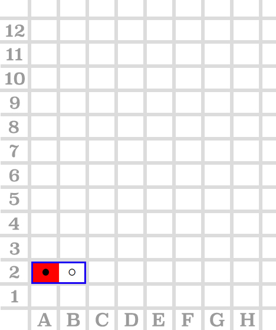
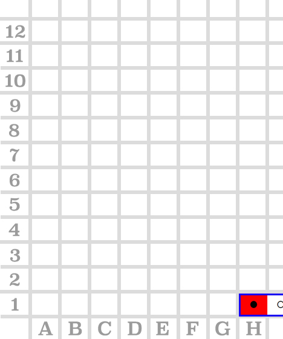
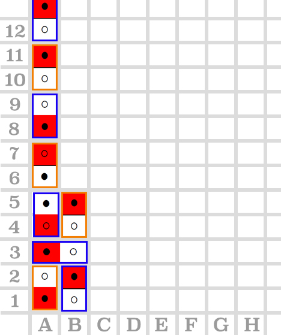
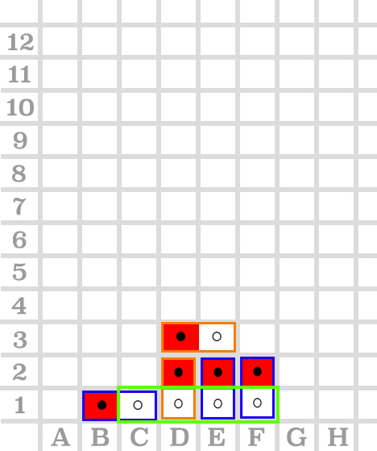
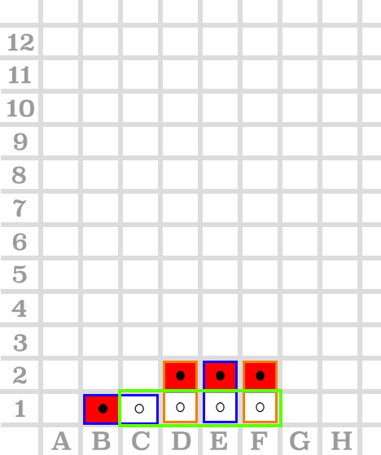
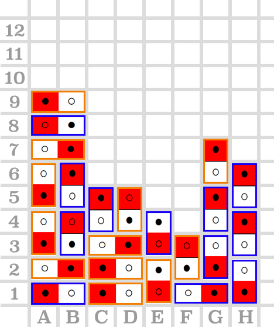
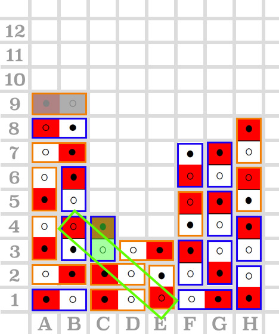

# comp6721
counter four

## Test results (Double-Card-2nd-Version):

| # | command input  | configuration image | test result | comments |
| -:|------------------|:--------------------|:------------|:---------|
| #1|  dots   0 1 A 2  |   | 测试通过 | 测试放置悬空的卡片 |
| #2|  dots   0 1 A 1   0 1 B 2 |   | 测试通过  | 测试放置半悬空的卡片  |
| #3|  dots   0 1 H 1 |   | 测试通过  | 测试卡片片段超出board x轴情况  |
| #4|  dots   0 2 B 1   0 4 A 1   0 1 A 3   0 2 B 4   0 8 A 4   0 6 A 6   0 4 A 8   0 2 A 10   0 2 A 12 |   | 测试通过  | 测试卡片片段超出board y轴情况  |
| #5|  dots   0 5 A 1   0 2 A 2   0 6 D 1   0 4 B 2   0 8 C 1   0 7 C 3   0 1 A 4   0 7 C 4   0 6 C 5 |   | Failed | 测试在player1放置0 6 C 5卡片后，player1和player2同时满足赢的状态下，判定player1赢 |
| #6|  dots   0 1 B 1   0 2 D 1   0 2 E 1   0 1 D 3   0 2 F 1 |   | Failed  | 测试在player1回合落字后，判定player1赢的情况  |
| #7|  dots   0 1 B 1   0 2 D 1   0 2 E 1   0 2 F 1 |   | Failed  | 测试在player2回合落字后，判定player1赢的情况  |
| #8|  dots   0 1 A 1   0 1 C 1   0 3 F 1   0 8 E 1   0 4 H 1   0 3 A 2   0 4 G 2   0 1 C 2   0 2 H 3   0 4 A 3   0 6 B 3   0 3 D 3   0 2 G 4   0 4 A 5   0 2 F 2   0 6 F 4   0 2 B 5   0 3 A 7   0 5 A 8   0 1 A 9   0 2 G 6   0 6 H 5   0 8 F 6   0 2 H 7   (recycle moves start)   A 9 B 9 2 C 3 |     (recycle moves start)       position: (A 9 B 9) -> (F 4)   rotation: 1->2 | Failed   recycles 开始后输入 A 9 B 9 2 C 3，提示 "try again" | player1 在recycle moves环节，  移动卡片(A 9 B 9)至(F 4)   并且改变旋转1至2，  判定player1赢 | 
| #8|   |   |   |

in the configuration images:
> **Blue square** means the piece that player1 drops

> **Orange square** means the piece that player2 drops

> **Green square** means that the winning position

> **card with Grey shallow** means that 在recycle moves回合中已经被移动到其他地方的卡片

> **card with Green shallow** means that 在recycle moves回合中从其他地方移动过来的卡片

****Test 5 6 7 has passed. Test 7: player 2 should win, cause player1 choose dots. When player2 palce the card, which is satisfied color and dots. But Player 2 palce card, according to rule, player 2 win
****Test 8 has passed. Test 8: when player 2 input 0 3 C 3, the player 1 statisfy condition of win. Because the sum of diagonal equals to 4. The game is ended
