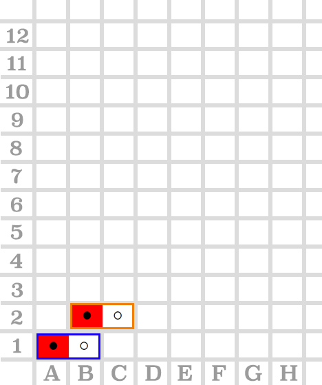

# comp6721
counter four

## Test results (Double-Card-2nd-Version):

| command input  | configuration image | test result | comments |
|----------------|:--------------------|:------------|:---------|
|  dots   0 1 A 2  |   | 测试通过 | 测试放置悬空的卡片 |
|  dots   0 1 A 1   0 1 B 2 |   | 测试通过  | 测试放置悬空的卡片  |
|  dots   0 5 A 1   0 2 A 2   0 6 D 1   0 4 B 2   0 8 C 1   0 7 C 3   0 1 A 4   0 7 C 4   0 6 C 5 |   | Failed | 测试在player1放置0 6 C 5卡片后，player1和player2同时满足赢的状态下，判定player1赢 |
|   |   |   |   |

in configuration images:
> **Blue square** means the piece that player1 drops

> **Orange square** means the piece that player2 drops

> **Green square** means that the winning position.
