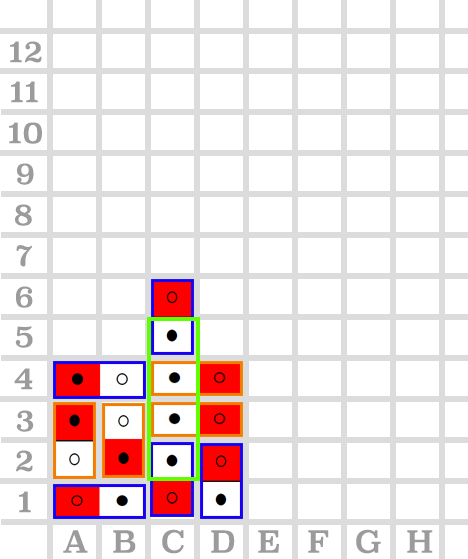
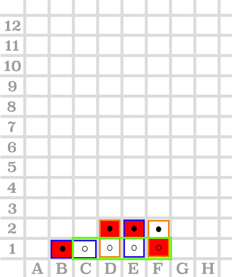

# comp6721
counter four

## Test results (Double-Card-2nd-Version):

| # | command input  | configuration image | test result | comments |
| -:|----------------|:--------------------|:------------|:---------|
| #1|  dots   0 1 A 2  |   | 测试通过 | 测试放置悬空的卡片 |
| #2|  dots   0 1 A 1   0 1 B 2 |   | 测试通过  | 测试放置半悬空的卡片  |
| #3|  dots   0 1 H 1 |   | 测试通过  | 测试卡片片段超出board x轴情况  |
| #4|  dots   0 2 B 1   0 4 A 1   0 1 A 3   0 2 B 4   0 8 A 4   0 6 A 6   0 4 A 8   0 2 A 10   0 2 A 12 |   | 测试通过  | 测试卡片片段超出board y轴情况  |
| #5|  dots   0 5 A 1   0 2 A 2   0 6 D 1   0 4 B 2   0 8 C 1   0 7 C 3   0 1 A 4   0 7 C 4   0 6 C 5 |   | Failed | 测试在player1放置0 6 C 5卡片后，player1和player2同时满足赢的状态下，判定player1赢 |
| #6|  dots   0 1 B 1   0 2 D 1   0 2 E 1   0 1 D 3   0 2 F 1 |   | Failed  | 测试在player1回合中，判定player1赢的情况  |
| #7|  dots    0 1 B 1   0 2 D 1   0 2 E 1   0 2 F 1 |   | Failed  | 测试在player2回合落字后，判定player1赢的情况  |
| #8|   |   |   |

in the configuration images:
> **Blue square** means the piece that player1 drops

> **Orange square** means the piece that player2 drops

> **Green square** means that the winning position
