**Room**: H-817

**Machine**: Row-2 leftmost

**Environment**: Linux terminal

**all test cases are corresponding to the test cases in the README.md in the master branch.**

at the very beginning before all test cases, execute **module load python/3.5.1** on the console

-------------------------------------------------------------------------------------------

| # | command input  | output image | test result | comments |
| -:|------------------|:--------------------|:------------|:---------|
| #1|  dots   0 1 A 2  | 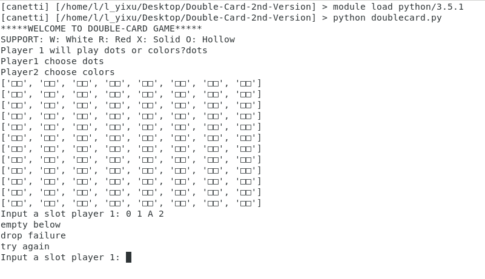  | Pass | 测试放置悬空的卡片 |
| #2|  dots   0 1 A 1   0 1 B 2 | 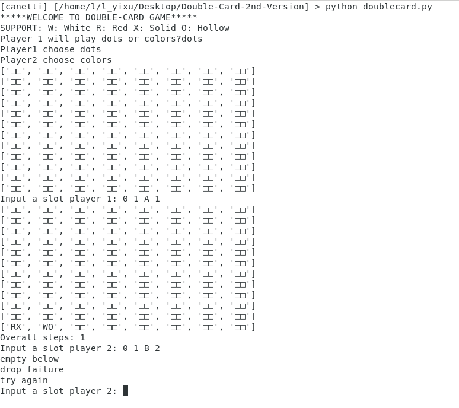  | Pass  | 测试放置半悬空的卡片  |
| #3|  dots   0 1 H 1 | 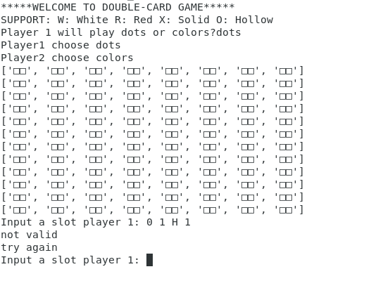  | Pass | 测试卡片片段超出board x轴情况  |
| #4|  dots   0 2 B 1   0 4 A 1   0 1 A 3   0 2 B 4   0 8 A 4   0 6 A 6   0 4 A 8   0 2 A 10   0 2 A 12 | 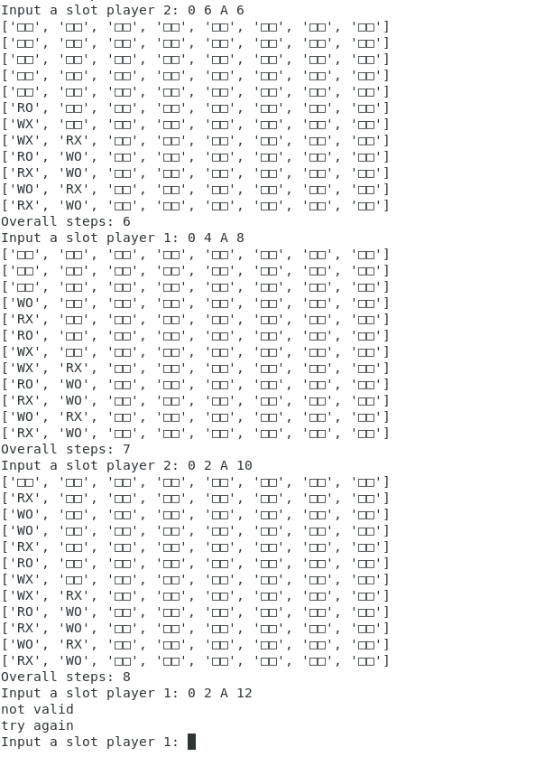  | Pass | 测试卡片片段超出board y轴情况  |
| #5|  dots   0 5 A 1   0 2 A 2   0 6 D 1   0 4 B 2   0 8 C 1   0 7 C 3   0 1 A 4   0 7 C 4   0 6 C 5 | 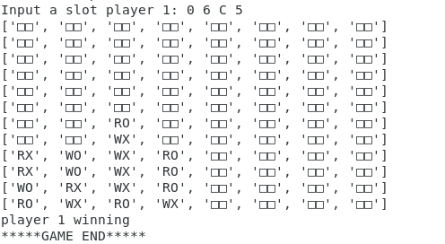  | Pass | 测试在player1放置0 6 C 5卡片后，player1和player2同时满足赢的状态下，判定player1赢 |
| #6|  dots   0 1 B 1   0 2 D 1   0 2 E 1   0 1 D 3   0 2 F 1 | 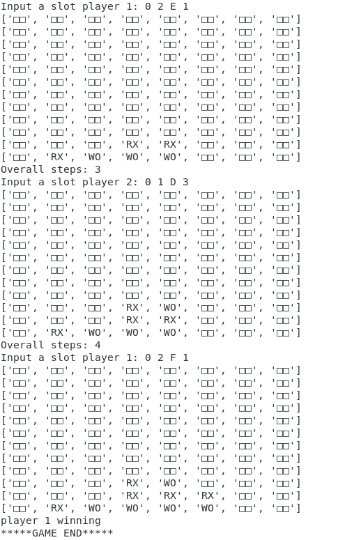  | Pass  | 测试在player1回合落字后，判定player1赢的情况  |
| #7|  dots   0 1 B 1   0 2 D 1   0 2 E 1   0 8 F 1 | 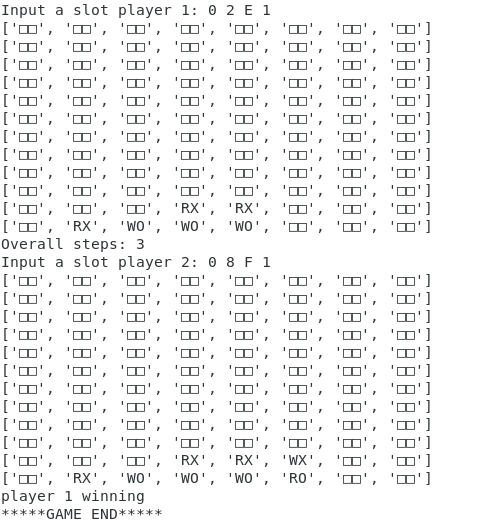  | Pass  | 测试在player2回合落字后，判定player1赢的情况  |
| #8|  dots   0 1 A 1   0 1 C 1   0 3 F 1   0 8 E 1   0 4 H 1   0 3 A 2   0 4 G 2   0 1 C 2   0 2 H 3   0 4 A 3   0 6 B 3   0 3 D 3   0 2 G 4   0 4 A 5   0 2 F 2   0 6 F 4   0 2 B 5   0 3 A 7   0 5 A 8   0 1 A 9   0 2 G 6   0 6 H 5   0 8 F 6   0 2 H 7   (recycle moves start)   A 9 B 9 2 C 3 | 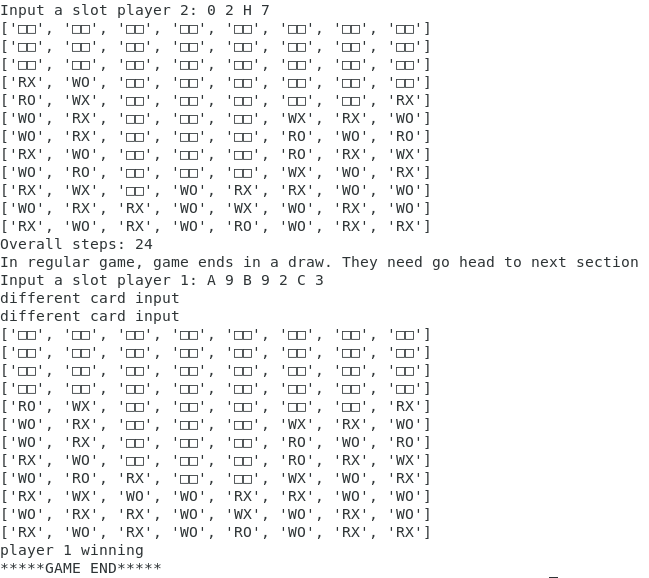 | Pass | player1 在recycle moves环节，  移动卡片(A 9 B 9)至(C 3)   并且旋转卡片 1->2，  判定player1赢 |
| #9| ...   (recycle前输入与#8相同)   (recycle moves start)   A 9 B 9 3 C 4  | 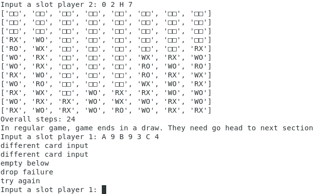 | Pass | 测试recycle环节，player1拿起一张卡片放到半悬空的位置  |
| #10| ...   (recycle前输入与#8相同)   (recycle moves start)   A 9 B 9 3 D 4  | 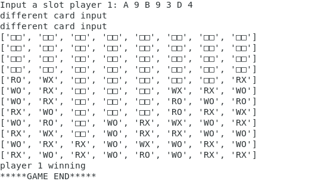 | Pass | 测试recycle环节   player1拿起卡片(A 9 B 9)放到(D 4)位置   旋转卡片1->3   判断在player1和player2都满足赢的状况下，判定player1赢 |
| #11| ...   (recycle前输入与#8相同)   (recycle moves start)   A 9 B 9 3 F 8   F 8 G 8 4 E 4 | 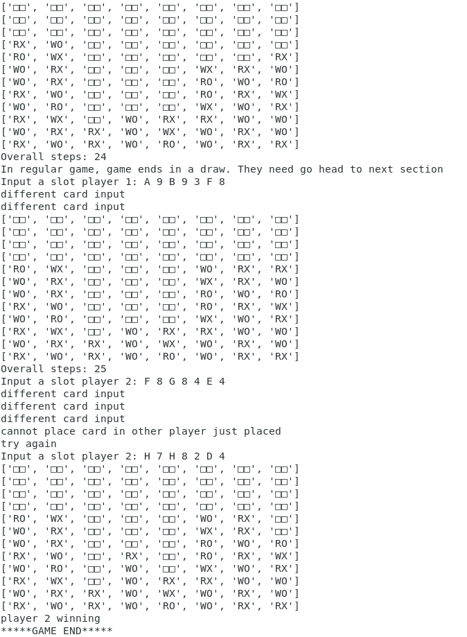 | Pass | 测试recycle环节   player2拿起player1刚刚移动过的卡片   应提示player2重新选择要拿起的卡片 |
| #12| ...   (recycle前输入与#8相同)   (recycle moves start)   A 9 B 9 1 A 9 | 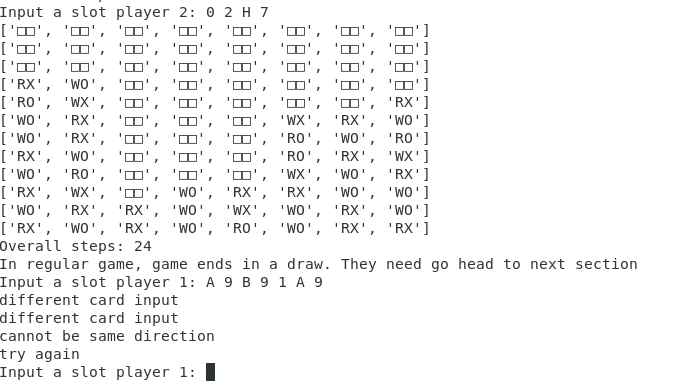 | Pass | 测试recycle环节   player1拿起一张卡片不做任何操作，放回原先位置情况，应提示player1重新选择落字的位置  |
| #13| ...   (recycle前输入与#8相同)   (recycle moves start)   C 2 D 2 3 D 4 | 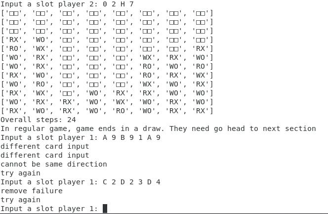 | Pass | 测试recycle环节   由于player1拿起的一张卡片而导致board出现invalid configuration的情况，应当提示player1重新选择要拿起的卡片  |
| #14| colors   0 1 B 1   0 2 D 1   0 2 E 1   0 1 D 3   0 1 D 4   0 6 F 1  | 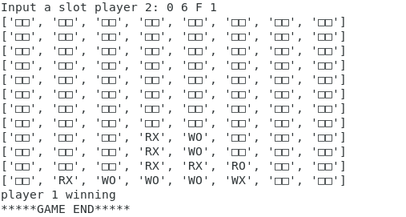  | Pass | 测试player1选择颜色，player1赢的情况  |
| #15| colors   0 1 B 1   0 2 D 1   0 2 E 1   0 1 D 3   0 6 C 2   0 6 B 2  | 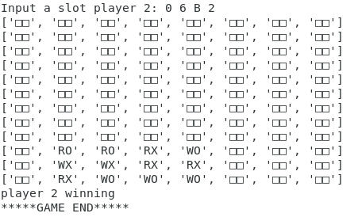  | Pass | 测试player1选择颜色，player1输得情况 |
| #16| ...   (recycle前输入与#8相同)   (recycle moves start)   A 9 A 8 1 C 3 | 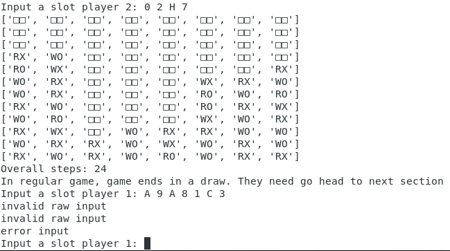  | Pass | 测试recycle阶段，输入来自两个不同卡片的分别一个片段 |
| #17| ...   (recycle前输入与#8相同)   (recycle moves start)   A 9 B 9 1 F 8| 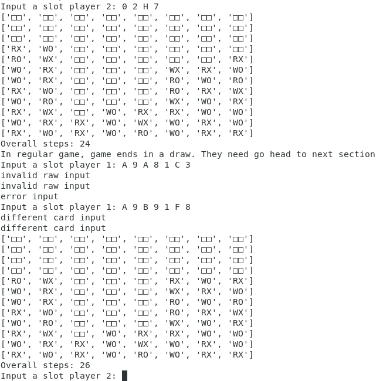 | Pass | 测试recycle阶段，输入不改变卡片旋转，只改变卡片位置 |

in the configuration images:
> **Blue square** means the piece that player1 drops

> **Orange square** means the piece that player2 drops

> **Green square** means that the winning position

> **card with Grey shallow** means that 在recycle moves回合中已经被移动到其他地方的卡片

> **card with Green shallow** means that 在recycle moves回合中从其他地方移动过来的卡片
